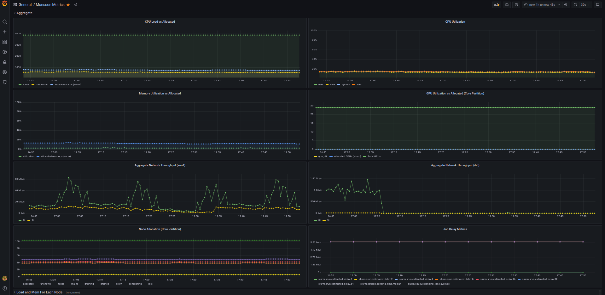
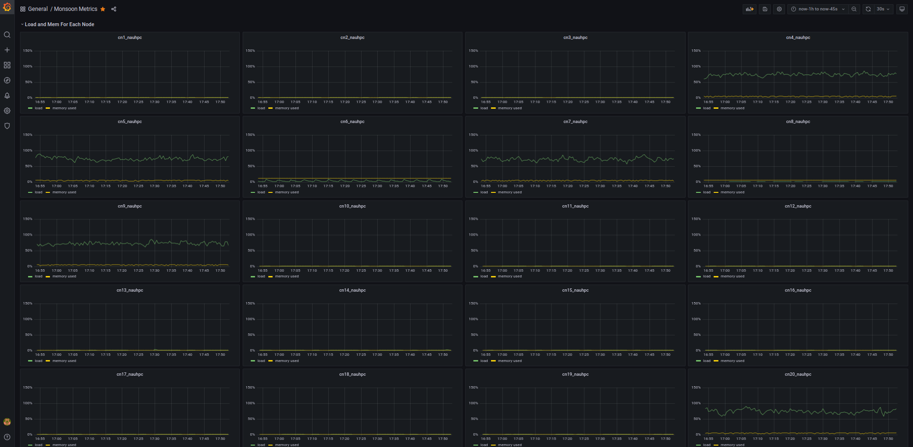
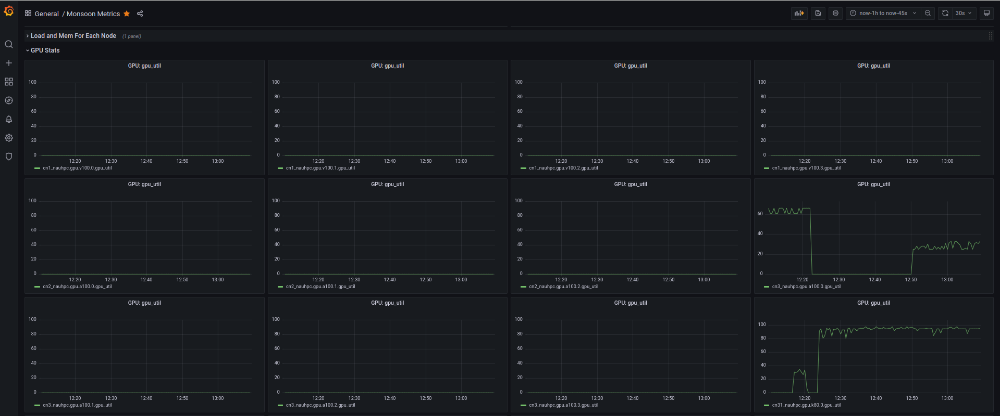
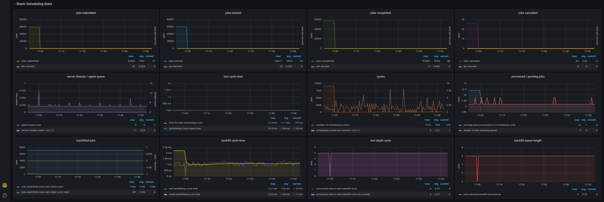

# Overview

This repository contains:
- screenshots and JSON files from our grafana dashboards
- scripts for importing ganglia data into graphite
- scripts for collecting slurm and gpu metrics

Everything here was built for a Graphite v1.1.8 instance.

## Grafana Dashboards

### Monsoon Metrics

This is a monolithic dashboard. We included 4 rows, which in grafana are like folders containing multiple panels.

- Aggregate Metrics (Row 1)

  - contains panels where we show cluster-wide metrics like the 1-min load, slurm node states, etc.
  
- Load and Mem For Each Node (Row 2)

  - contains a graph for each node, showing the 1-min load and memory used
  
- GPU Stats (Row 3)

  - contains a graph for each GPU, showing the gpu utilization by default (can be selected with the variable widget at the top of the dashboard)
  
- Slurm Scheduling Stats (Row 4)

  - contains a graphs for a variety of metrics from slurm's [sdiag](https://slurm.schedmd.com/sdiag.html) command

### Single Node View

- contains metrics similar to the Aggregate Metrics row of the main dashboard, but for a single node
- can select the node and which gpu metric to show with the two variable widgets at the top

## Importing Ganglia Data Into Graphite

### Background

The datedness of ganglia prompted our investigation into alternatives. The two best alternatives that we found were prometheus and graphite. But after setting up prometheus, we decided that the complete lack of down-sampling would not work for us (this may have changed since late 2021) since we wanted to collect long term data.

[Graphite Documentation](https://graphite.readthedocs.io/en/latest/)
   
[Ganglia Documentation](http://ganglia.info/)

Ganglia uses RRD files which are similar to Graphite's whisper files. They are great at storing large amounts of time series data, without using much disk space. Each file contains a single metric for a specified time frame and interval. Downsampling allows us to save space by storing longer-term data at a 30 minute interval and nera-term data on a 30 second interval. The small storage space requirement means we can easily keep everything on fast local storage instead of moving to some kind of network file system.

Most of the system data we collect per host comes from a collectd instance running on each node. Collectd is available via an RPM, and it has a helpful write\_graphite plugin.

The export\_worker.py and import\_worker.py scripts from this repo may be particularly helpful if you are moving from a ganglia instance to graphite like we were.

### Exporting

#### [export\_worker.py](./scripts/export_worker.py)

    usage: export_worker.py [-h] [-p] [-t] file
    
    positional arguments:
      file             RRD file
    
    optional arguments:
      -h, --help       show this help message and exit
      -p, --pickle     Export data into python's pickle format (serialized binary
                       data), will use the .pkl extension, this should allow for
                       much faster importing into graphite
      -t, --plaintext  Export data into a plaintext format

It expects one non-default python module, bs4, which is used for parsing XML data. bs4 can be easily obtained via pip or conda.

The script will export an RRD file into either a plaintext file that could be netcat-ed into graphite via port 2003 (used for the plaintext protocol) or into a pickle file that can be imported into graphite via port 2004 (used for the pickle protocol).

We used a slurm job script that looked like this to export ~3000 files. It took 4 minutes on 64 cores.

    #!/bin/bash
    
    module load anaconda3
    conda activate ganglia_exp
    
    find ./data/ -regextype 'egrep' -regex '.*cn[0-9]+\.nauhpc.*' -type f | \
        sort -V | \
        parallel --jobs="${SLURM_CPUS_PER_TASK}" ./export_worker.py {}

### Importing

#### [import\_pickle\_file.py](./scripts/import_pickle_file.py)

    usage: import_pickle_file.py [-h] [--host [HOST]] [-p [PORT]] file [file ...]
    
    Script for importing properly formatted PKL files into a graphite-web
    instance. More specifically, this targets the carbon-cache daemon which by
    default listens on port 2004.
    
    positional arguments:
      file                  PKL file
    
    optional arguments:
      -h, --help            show this help message and exit
      --host [HOST]         hostname where carbon-cache is running
      -p [PORT], --port [PORT]
                            port where carbon-cache is listening for the pickle
                            protocol

We used this script for every pickle file created by the export_worker.py script. It can be used more generically if your pickle files contain data in the list of tuples format like this:

   [(path, (timestamp, value)), ...]

The usage is straight forward, we used the import_job.sh bash script included in
this repo to import a directory of files.

IMPORTANT: 

If you have large pickle files (greater than 1MB), graphite will silently drop them with its default config parameters, not ingesting any metrics. There are only two ways to get around this. You can split up the pickle files (the pickle files contain lists so would be simple) or temporarily set two fields in your carbon.conf (USE\_FLOW\_CONTROL to false, and PICKLE\_RECEIVER\_MAX\_LENGTH to a higher value).

## Collecting Slurm and GPU Metrics

### Slurm Metrics

We're using two scripts for exporting slurm metrics. The first provides a comprehensive list of metrics using the squeue, sinfo, sdiag, and sshare binaries. The second is very lightweight, focusing only on scheduling delay.

#### [slurm_exporter.py](./scripts/slurm_exporter.py)

Note: You'll also need the ClusterShell pip package.

    usage: slurm_exporter.py [-h] [-p PREFIX] [--no-squeue] [--no-sinfo]
                             [--no-sdiag] [--no-sshare] [-s] [-P PORT] [-t TARGET]
    
    Export Slurm metrics to Graphite
    
    optional arguments:
      -h, --help            show this help message and exit
      -p PREFIX, --prefix PREFIX
                            metrics prefix (i.e. slurm.)
      --no-squeue           do not grab squeue metrics
      --no-sinfo            do not grab sinfo metrics
      --no-sdiag            do not grab sdiag metrics
      --no-sshare           do not grab sshare metrics
      -s, --send            send data to graphite's over the plaintext protocol
      -P PORT, --port PORT  port to send data to (default: 2003), must also enable
                            the -s/--send flag
      -t TARGET, --target TARGET
                            the hostname or ip to send the graphite data to
                            (default: localhost), must also enable the -s/--send
                            flag

#### [sched_delay_exporter.awk](./scripts/sched_delay_exporter.awk)

    Usage: ./sched_delay_exporter.awk -- [OPTIONS]
            hostname    hostname of the target, if set, it will send graphite data to port 2003
                        using the plaintext protocol, otherwise print to stdout
            -h, --help  display this help message

### GPU Metrics

#### [gpu_exporter.awk](./scripts/gpu_exporter.awk)

This script expects the nvidia-smi binary to exist. It would only work for nvidia GPUs.

    Usage: ./gpu_exporter.awk -- [OPTIONS]
            hostname    hostname of the target, if set, it will send graphite data to port 2003
                        using the plaintext protocol, otherwise print to stdout
            -s suffix, --suffix=suffix
                        the suffix to be appended to the hostname for all metric names
            -h, --help  display this help message
